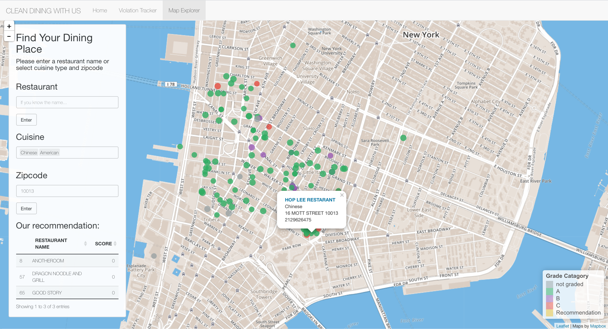
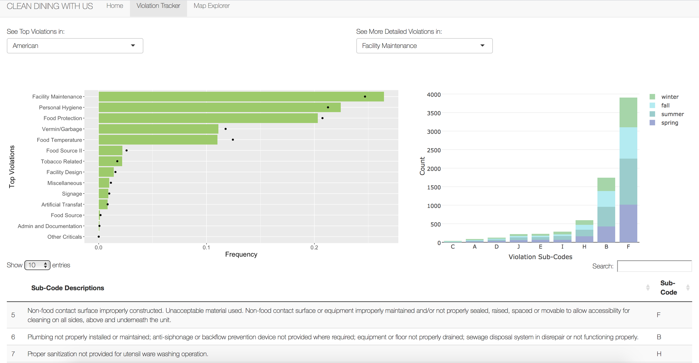

# Project 2: Open Data App - an RShiny app development project

### [Project Description](doc/project2_desc.md)







## Project 2: Open Data App - an RShiny app development project
Term: Spring 2017

[ShinyApp link](https://ads-yz3032.shinyapps.io/nycrestaurantviolation/)

+ Team 5
+ **Clean Dining: Visualizing NYC Restaurant Violations**: 
+ Team members
	+ Zhengyuan Guo (zg2256)
	+ Jiahao Zhang (jz2773)
	+ Yingxin Zhang (yz3032)
	

+ **Project summary**: In this project, we seek to develop an app using R Shiny to visualize NYC restaurant violation data. The app is divided into two pages: Violation Tracker and Map Explorer. Violation Tracker, which is designed for restaurant owners, displays the distribution of different types of violations. For each type of violation, the app further exhibits the profile of its subgroups, providing restaurant owners with valuable insights on potential violations within selected cuisine types. Map Explorer servers individual customers by offering recommendations on restaurants given selected cuisine types and zipcode. The location of filtered restaurants are marked in different colors according to their grades. The Yelp links are also available when markers are clicked.
+ **Contribution statement**: ([default](doc/a_note_on_contributions.md)) All team members contributed equally in all stages of this project. All team members approve our work presented in this GitHub repository including this contributions statement. 

Following [suggestions](http://nicercode.github.io/blog/2013-04-05-projects/) by [RICH FITZJOHN](http://nicercode.github.io/about/#Team) (@richfitz). This folder is orgarnized as follows.

```
proj/
-app/
-lib/
-data/
-doc/
-output/
```

Please see each subfolder for a README file.

